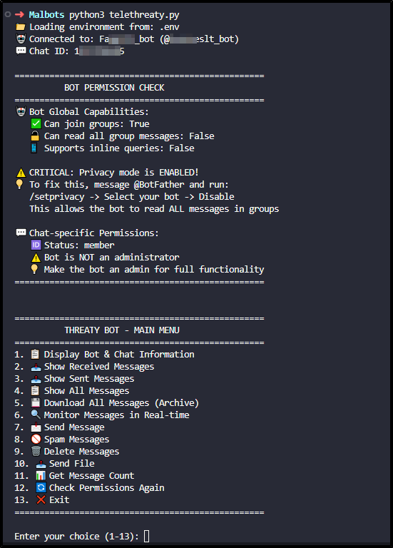

# TeleThreaty 🕵️‍♂️

Advanced Telegram monitoring and threat hunting tool designed for cybersecurity analysts to track malicious activity, exfiltrated credentials, and stealer logs communicated through Telegram.

## 🚨 Purpose

TeleThreaty is designed for cybersecurity professionals to:
- Monitor Telegram channels used by threat actors
- Track credential exfiltration attempts
- Analyze stealer log distribution
- Investigate malicious bot activities
- Archive threat intelligence from Telegram

## ✨ Features

### 🔍 Monitoring & Intelligence
- Real-time message monitoring with long polling
- Complete message history retrieval
- Permission-aware message filtering
- Chat and bot intelligence gathering

### 📁 Advanced File Handling
- Automatic file type categorization (archives, documents, code, etc.)
- Smart download organization by file type
- Download URL generation for all attachments
- Support for 50+ file formats including malware samples

### ⚡ Operational Capabilities
- Bulk message deletion (within 48-hour window)
- Message spamming for operational testing
- File exfiltration capabilities
- Multi-processing for high-speed operations

### 🔐 Permission Management
- Comprehensive permission checking
- Privacy mode detection and guidance
- Admin right verification
- Chat-specific capability analysis

## 🛠️ Installation

### Prerequisites
- Python 3.8+
- Telegram Bot Token from [@BotFather](https://t.me/BotFather)
- Target Chat/Channel ID

### Quick Setup

1. **Clone the repository**

```bash
git clone https://github.com/your-username/TeleThreaty.git
cd TeleThreaty
```

2. Install dependencies

```bash
pip install -r requirements.txt
```

3. Configure environment

```bash
# Edit .env with your credentials
cp .env.example .env
```

4. Run the tool

```bash
python3 telethreaty.py
```

## Configuration

`.env` File Setup

```ini
# Required: Get from @BotFather
TELEGRAM_BOT_TOKEN=1234567890:AAFxampleToken123456789

# Required: Target chat/channel ID
TELEGRAM_CHAT_ID=-1001234567890

# Optional: Adjust these as needed
MESSAGE_LIMIT=1000
TIMEOUT=30
LOG_LEVEL=INFO
```

### Obtaining Credentials

1. Bot Token: Message [@BotFather](https://t.me/BotFather) and create a new bot
2. Chat ID: Use @userinfobot or send a message and check updates API

## Usage

Interactive Mode

```bash
python3 telethreaty.py
```

Follow the menu prompts for all operations.



Command Line Options

```bash
# Display help
python telethreaty.py --help

# Check permissions only
python telethreaty.py --check-permissions

# Monitor messages in real-time
python telethreaty.py --monitor

# Download all messages to archive
python telethreaty.py --download-all
```


## Acknowledgements

Inspired by [TeleTracker](https://github.com/tsale/TeleTracker) - Special thanks to the TeleTracker project for pioneering Telegram monitoring capabilities and providing inspiration for several advanced features in this tool.

Related Projects
- [TeleTracker](https://github.com/tsale/TeleTracker) - Original Telegram monitoring tool
- [Pyrogram](https://github.com/pyrogram/pyrogram) - Telegram MTProto API Client
- [Python-Telegram-Bot](https://github.com/python-telegram-bot/python-telegram-bot) - Telegram Bot API wrapper

## 📜 License

This project is licensed under the [MIT](./LICENSE) License - see the LICENSE file for details.

## ⚠️ Disclaimer

This tool is intended for:

- Cybersecurity research and education
- Threat intelligence gathering
- Legitimate security operations

Use responsibly and legally. The author is not responsible for misuse of this tool.

## 🐛 Bug Reports & Feature Requests

Please create issues for:

- Bug reports with detailed reproduction steps
- Feature requests with use case descriptions
- Security vulnerabilities (please disclose responsibly)

## 🏆 Contributing

1. Fork the repository
2. Create a feature branch (`git checkout -b feature/amazing-feature`)
3. Commit changes (`git commit -m 'Add amazing feature'`)
4. Push to branch (`git push origin feature/amazing-feature`)
5. Open a Pull Request